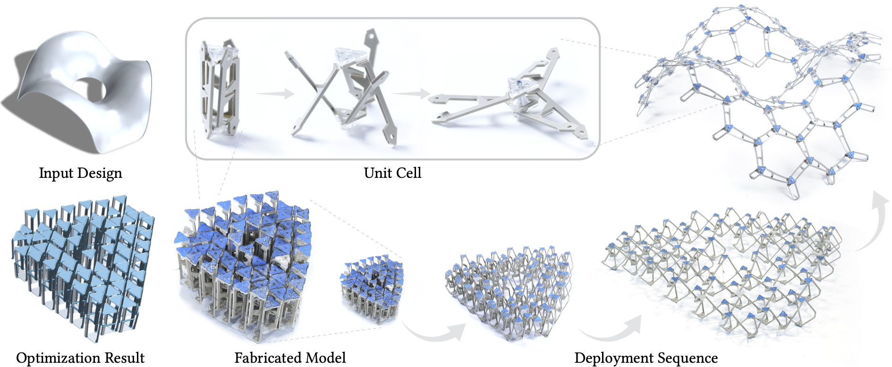

<!-- PROJECT LOGO -->
<p align="center">

  <h1 align="center"><a href="https://lgg.epfl.ch/publications/2022/UmbrellaMeshes/index.php/">Umbrella Meshes: Elastic Mechanisms for Freeform Shape Deployment</a></h1>



  <p align="center">
    ACM Transactions on Graphics (Proceedings of SIGGRAPH), July 2022.
    <br />
    <a href="http://samararen.github.io//"><strong>Yingying Ren*</strong></a>
    ·
    <a href="http://lgg.epfl.ch/people.php?p=1/"><strong>Uday Kusupati*</strong></a>
    ·
    <a href="http://julianpanetta.com/"><strong>Julian Panetta</strong></a> 
    ·
    <a href="http://lgg.epfl.ch/people.php?p=1"><strong>Florin Isvoranu</strong></a> 
    ·
    <a href="http://lgg.epfl.ch/people.php?p=1"><strong>Davide Pellis</strong></a>
    ·
    <a href="http://lgg.epfl.ch/people.php?p=1/"><strong>Tian Chen</strong></a>
    ·
    <a href="http://lgg.epfl.ch/people.php?p=1"><strong>Mark Pauly</strong></a>
    <br />
    *joint first author (order determined by coin toss)
  </p>

  <p align="center">
    <a href='https://lgg.epfl.ch/publications/2022/UmbrellaMeshes/paper.pdf'>
      
    </a>
    <a href='https://lgg.epfl.ch/publications/2022/UmbrellaMeshes/index.php' style='padding-left: 0.5rem;'>
      
    </a>
  </p>
</p>

## About

This repository contains the source code and data for the paper Umbrella Meshes: Elastic Mechanisms for Freeform Shape Deployment, published at SIGGRAPH 2022. 

## Getting Started

## C++ Code Dependencies

The C++ code relies on `boost` and `cholmod/umfpack`. The design optimization part of the code also depend on the commercial
optimization package [`knitro`](https://www.artelys.com/solvers/knitro/); these
will be omitted from the build if `knitro` is not found.

### macOS
You can install all the necessary dependencies except `knitro` on macOS with [MacPorts](https://www.macports.org):

```bash
# Build/version control tools, C++ code dependencies
sudo port install cmake boost suitesparse ninja glew
# Dependencies for jupyterlab/notebooks
sudo port install npm6
conda install python
```

### Ubuntu 19.04
A few more packages need to be installed on a fresh Ubuntu 19.04 install:
```bash
# Build/version control tools
sudo apt install git cmake ninja-build
# Dependencies for C++ code
sudo apt install libboost-filesystem-dev libboost-system-dev libboost-program-options-dev libsuitesparse-dev
# LibIGL/GLFW dependencies
sudo apt install libgl1-mesa-dev libxrandr-dev libxinerama-dev libxcursor-dev libxi-dev
# Offscreen render dependencies
sudo apt install libglew-dev libpng-dev
# Dependencies (pybind11, jupyterlab/notebooks)
sudo apt install python3-pip npm
# Ubuntu 19.04 packages an older version of npm that is incompatible with its nodejs version...
sudo npm install npm@latest -g
```

## Obtaining and Building

Clone this repository *recursively* so that its submodules are also downloaded:

```bash
git clone --recursive https://github.com/EPFL-LGG/UmbrellaMesh
```

Build the C++ code and its Python bindings using `cmake` and your favorite
build system. For example, with [`ninja`](https://ninja-build.org):

```bash
cd UmbrellaMesh
mkdir build && cd build
cmake .. -GNinja
ninja
```


## Running the Jupyter Notebooks
The preferred way to interact with the code is in a Jupyter notebook,
using the Python bindings.
We highly recommend that you install the Python dependencies and JupyterLab itself in a
virtual environment (e.g., with [venv](https://docs.python.org/3/library/venv.html)).


```bash
pip3 install wheel # Needed if installing in a virtual environment
pip3 install jupyterlab==3.3.4 ipykernel==5.5.5 ipywidgets==7.7.2 jupyterlab-widgets==1.1.1 # Use a slightly older version of ipykernel to avoid cluttering notebook with stdout content.
# If necessary, follow the instructions in the warnings to add the Python user
# bin directory (containing the 'jupyter' binary) to your PATH...

git clone https://github.com/jpanetta/pythreejs
cd pythreejs
pip3 install -e .
cd js
jupyter labextension install .

pip3 install matplotlib numpy scipy pytest
```

Launch Jupyter lab from the root python directory:
```bash
cd python
jupyter lab
```

There are four demos in `python/live_demos`. Try them out!


# License and Citation
The code of Umbrella Meshes is license under [MIT License](LICENSE). 
If you use parts of this code for your own research, please consider citing our paper:
```bibtex
@article{RKP2022umbrellameshes,
	author = {Ren, Yingying and Kusupati, Uday and Panetta, Julian and Isvoranu, Florin and Pellis, Davide and Chen, Tian and Pauly, Mark},
	title = {Umbrella Meshes: Elastic Mechanisms for Freeform Shape Deployment},
	year = {2022},
	issue_date = {July 2022},
	publisher = {Association for Computing Machinery},
	address = {New York, NY, USA},
	volume = {41},
	number = {4},
	issn = {0730-0301},
	url = {https://doi.org/10.1145/3528223.3530089},
	doi = {10.1145/3528223.3530089},
    journal = {Transactions on Graphics (Proceedings of SIGGRAPH)},
	month = {jul},
	articleno = {152},
	numpages = {15},
	keywords = {deployable structure, computational design, numerical optimization, fabrication, physics-based simulation}
}
```
